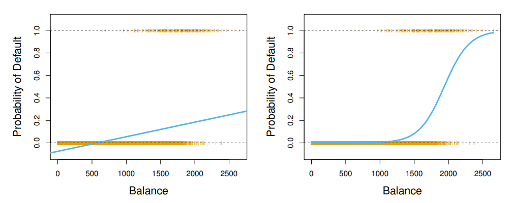

 

# 1. 분류의 개요 

질적 반응변수를 예측하는 것은 관측치를 분류하는 것이다.  
이 떄 사용되는 분류기는 로지스틱 회귀, 선형판별분석, K-최근접이웃이 있다.  
일반화가법모델, 트리, 랜덤포레스트 및 부스팅, SVM은 뒤에서 다룬다.

 
 

# 2. 왜 선형회귀를 사용하지 않는가?

 

이진분류 문제라면 반응변수 $Y$가 0 또는 1의 값으로 둘 수 있다.  
이 때 선형모형을 적합하면 위의 사진의 왼쪽 패널처럼 [0,1] 범위를 벗어나게 된다.  
(이진분류에 선형회귀를 사용하면 선형판별분석 결과와 동일하다.)  

반응변수가 다범주인 경우도 있다.  

$$
Y =
\begin{cases}
    1 & \text{뇌졸중인 경우 }  y_k=1 \\
    2 & \text{약물 과다복용인 경우 }  y_k=-1 \\
	3 & \text{간질발작인 경우} 
\end{cases}
$$

위의 세 가지 의료상태가 긴밀한 관계가 있다고 하자.  
이 질적변수의 순서정보를 포함하면서도 양적변수로 바꿀 수 있는 방법은 없다.

 
 

# 3. 로지스틱 회귀(Logistic Regression)

로지스틱 회귀는 반

